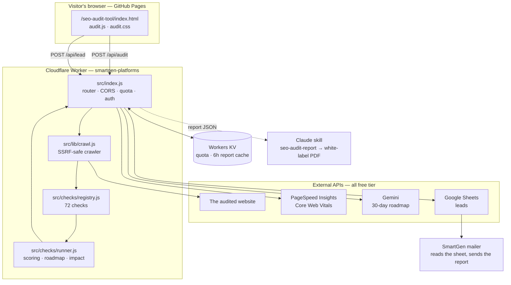

# SmartGen SEO Audit Tool — Architecture & Deployment Map

Everything about how the SEO Audit Tool is wired together: which file does what,
how data flows, what to deploy, and what to flip on when you are ready to charge.

- **Frontend** — `/seo-audit-tool/` on GitHub Pages (free)
- **Backend** — `backend/smartgen-platforms/`, a Cloudflare Worker (free tier)
- **Leads** — Google Sheets via a service account (free)
- **Report deliverable** — `.claude/skills/seo-audit-report/` (free)

Total running cost at launch: **$0**.

---

## 1. System map



**The one rule that shapes this design:** the Worker scans, and nothing else.
Email delivery lives in a separate tool that reads the spreadsheet. A slow or
failing inbox can therefore never stall an audit or take the API down.

---

## 2. File map

### Frontend — `seo-audit-tool/`

| File | Responsibility |
|---|---|
| `index.html` | Page shell, hero + scan form, lead form, pricing, the full 72-check catalogue rendered statically for SEO, FAQPage/WebApplication/BreadcrumbList schema |
| `audit.js` | Calls the API, renders the score dial, categories, findings and locked panel; captcha; deep-link `?url=` support |
| `audit.css` | Tool-specific styling on top of `assets/css/style.css`; dark-mode and print rules |

The API base lives in **one place** — the `<meta name="smartgen-api">` tag in
`index.html`. Change that line to repoint the frontend at a different Worker.

### Backend — `backend/smartgen-platforms/`

| File | Responsibility |
|---|---|
| `src/index.js` | Router, CORS, quota enforcement, premium unlock-token verification, lead handling |
| `src/lib/http.js` | SSRF guard, manual redirect following, body/time caps |
| `src/lib/parse.js` | HTML → structured document (metas, links, images, headings, JSON-LD, footer) |
| `src/lib/crawl.js` | Builds the audit context: homepage, robots.txt, sitemaps, `/index.php`, WP defaults, host variants, About page |
| `src/checks/registry.js` | **The 72 checks.** Each is a pure function of the context |
| `src/checks/runner.js` | Impact-weighted scoring, prioritisation, traffic prediction, deterministic roadmap |
| `src/lib/report.js` | Assembles the report, competitor comparison, white-label metadata |
| `src/lib/pagespeed.js` | Core Web Vitals from PageSpeed Insights |
| `src/lib/gemini.js` | AI executive summary + 30-day roadmap |
| `src/lib/sheets.js` | Service-account JWT → Sheets API row append |
| `src/lib/quota.js` | Anonymous per-visitor quota, burst brake, report cache |
| `test/registry.test.js` | 15 tests: registry invariants, scoring, roadmap, competitor fairness, SSRF guard |
| `scripts/mint-unlock-token.mjs` | Mints premium unlock tokens |

### Report deliverable — `.claude/skills/seo-audit-report/`

| File | Responsibility |
|---|---|
| `SKILL.md` | Workflow for turning audit JSON into the client-ready report |
| `scripts/render-report.mjs` | Report JSON + branding → print-ready white-label HTML |
| `references/report-structure.md` | What to write in each section |
| `references/fix-playbook.md` | Platform-specific remediation for every check |

### Site wiring

| File | Change |
|---|---|
| `tools/index.html` | Card in the "SEO & Content" category |
| `assets/js/search-data.js` | Entry in the site search index |
| `sitemap.xml` | URL at priority 0.9 |
| `llms.txt` | Listed under SEO Tools |
| `seo-metadata.json` | Title/description/keywords/features |

---

## 3. Check map — 72 checks, 27 free

Counts are asserted in `test/registry.test.js` against the published pricing
table, so the marketing page can never advertise a check the engine does not run.

| # | Category | id | Free | Total |
|---|---|---|---|---|
| 1 | 🔒 Authority & Technical | `authority` | 4 | 10 |
| 2 | 🏗️ Schema Markup | `schema` | 1 | 4 |
| 3 | 📄 E-E-A-T Pages | `eeat-pages` | 4 | 7 |
| 4 | 🦶 Footer E-E-A-T | `footer` | 4 | 10 |
| 5 | 📱 Social Presence | `social` | 2 | 8 |
| 6 | 🎨 UX Elements | `ux` | 3 | 5 |
| 7 | 👥 About Us Page | `about` | 0 | 9 |
| 8 | 🏠 Homepage Checks | `homepage` | 4 | 5 |
| 9 | ✅ E-E-A-T On-Site | `onsite` | 5 | 14 |
| | **Total** | | **27** | **72** |

`GET /api/checks` returns the live catalogue; the frontend renders its
comparison table from it. Editing `registry.js` updates the marketing page,
the pricing table and the audit itself in one move.

### Scoring

Each check carries an impact rating that becomes its weight:
`critical` 4 · `high` 3 · `medium` 2 · `low` 1.

- `pass` earns full weight, `warn` earns half, `fail` earns none.
- `skip` is excluded from the denominator, so a page with no images is not
  punished for image checks.
- Category scores are then weighted again (Authority ×1.4, Homepage ×1.3,
  E-E-A-T Pages ×1.3, …) to produce the overall score.

Grades: A ≥ 90 · B ≥ 80 · C ≥ 70 · D ≥ 55 · F below.

---

## 4. Free-tier policy — why 3 audits per day

One free audit is not enough to earn trust: the visitor scans their own site,
gets a number, and leaves. Five or more and there is no reason to ever pay.

**Three** matches how people actually use an audit tool — their own site, a
competitor, then a client's site. By the third run the tool has proved itself,
and the wall arrives exactly when intent is highest. It also keeps usage inside
Cloudflare's free KV write allowance (3 writes per audit ≈ 300 audits/day).

Change it with `FREE_AUDIT_LIMIT` in `wrangler.toml` — no code edit, no redeploy
of the frontend.

Visitors are identified by a SHA-256 of IP + user-agent + accept-language. No
cookie, no login, no consent banner needed for the quota itself.

---

## 5. Data flow — free audit

```
1. Visitor submits a URL
   → POST /api/audit  { url }

2. Worker: burst brake (4/min) → quota check (3/day) → 6h cache lookup

3. Cache miss → crawl (≈9 subrequests):
     homepage (+redirects) · robots.txt · sitemap probes
     /index.php · /hello-world/ · /sample-page/ · /category/uncategorized/

4. Run the 27 free checks → score → prioritise → predict impact

5. Consume one audit, cache the report for 6h, respond
   → { ok, quota, report }

6. Frontend renders score, categories, top 5 fixes, locked premium panel

7. Visitor submits the lead form
   → POST /api/lead  { lead, captcha, report summary }
   → captcha re-verified server-side, honeypot checked
   → row appended to the leads spreadsheet

8. The SmartGen mailer reads the sheet and sends the written report
```

## Data flow — premium audit

Steps 1–4 as above but with `deep: true` (adds host-variant probes, the
trailing-slash test and the About page fetch), then:

```
5. In parallel, none of which can fail the audit:
     PageSpeed Insights  → Core Web Vitals (field data preferred)
     Competitor URL      → same free-tier probe set → side-by-side comparison
                           (deliberately not a cheaper scan: skipping the
                            sitemap and default-content probes would silently
                            bias the comparison in the client's favour)
6. Gemini → executive summary + 30-day roadmap
     (deterministic roadmap ships as the fallback if Gemini is unavailable)
7. White-label metadata sanitised and attached
8. Lead recorded via ctx.waitUntil — never blocks the response
```

---

## 6. Leads spreadsheet map

`POST /api/lead` appends one row per lead, columns A→Y:

| Col | Field | Col | Field |
|---|---|---|---|
| A | Timestamp (UTC) | N | Checks Failed |
| B | Lead Type | O | Performance Score |
| C | Full Name | P | LCP |
| D | Email | Q | CLS |
| E | Website URL | R | Top Issue |
| F | Competitor URL | S | Source |
| G | Country | T | Referrer |
| H | WhatsApp | U | UTM Source |
| I | Preferred Contact | V | UTM Medium |
| J | Health Score | W | UTM Campaign |
| K | Grade | X | Country (Cloudflare) |
| L | Issues Found | Y | User Agent |
| M | Checks Passed | | |

The score, grade and top issue travel with the lead, so the mailer can segment
without re-running an audit — for example "everyone below 50 who has no privacy
policy" becomes a single spreadsheet filter.

**Setup:** create a service account, enable the Sheets API, then share the
spreadsheet with the service account's `client_email` as an **Editor**. Missing
that share step is the cause of nearly every 403 from the Sheets API.

Write the header row once:

```bash
curl -X POST "$API/api/admin/init-sheet" -H "Authorization: Bearer $ADMIN_TOKEN"
```

---

## 7. Where the API keys live — Cloudflare, never GitHub

This repository is **public** and the frontend is a **static page** on GitHub
Pages. Anything GitHub holds — a repo file *or* an Actions secret — ends up in a
file the browser downloads, because for a static site "build time" means
"written into the file". So every credential lives in Cloudflare's encrypted
secret store, and the Worker reads it at runtime.

| Value | Where | Why |
|---|---|---|
| `GOOGLE_SERVICE_ACCOUNT_JSON` | Cloudflare secret | write access to your Sheet |
| `LEADS_SHEET_ID` | Cloudflare secret | identifies your leads spreadsheet |
| `PAGESPEED_API_KEY` | Cloudflare secret | billable quota |
| `GEMINI_API_KEY` | Cloudflare secret | billable quota |
| `ADMIN_TOKEN` | Cloudflare secret | guards `/api/admin/*` |
| `PREMIUM_UNLOCK_SECRET` | Cloudflare secret | forges premium access if leaked |
| `ALLOWED_ORIGINS`, `FREE_AUDIT_LIMIT`, `PAYMENTS_ENABLED`, `PREMIUM_PRICE_USD`, `LEADS_SHEET_TAB` | `wrangler.toml` `[vars]` (committed) | not secret — config the public can see without harm |
| The Worker URL | GitHub, in `seo-audit-tool/index.html` | public by design; every visitor's browser calls it |

The Worker never returns a secret to the browser. The frontend knows exactly one
thing about the backend: its URL.

If a key is ever committed by accident, **rotate it** — deleting the commit is
not enough, public repos are scraped within minutes.

---

## 8. Deploy

### Backend

```bash
cd backend/smartgen-platforms
npm install
npx wrangler login

# KV is already created and wired into wrangler.toml:
#   SMARTGEN_AUDIT_KV          c4787a835bbb48f0bd1ed5cf03f23d49
#   SMARTGEN_AUDIT_KV_preview  db7cc5a006634b71bb4f7d15a082f4e5

npx wrangler secret put GOOGLE_SERVICE_ACCOUNT_JSON   # the whole .json, one line
npx wrangler secret put LEADS_SHEET_ID                # id from the Google Sheet URL
npx wrangler secret put PAGESPEED_API_KEY
npx wrangler secret put GEMINI_API_KEY
npx wrangler secret put ADMIN_TOKEN
npx wrangler secret put PREMIUM_UNLOCK_SECRET

npm test          # 15 tests must pass
npx wrangler deploy
```

### Frontend

1. Update `<meta name="smartgen-api">` in `seo-audit-tool/index.html` with the
   deployed Worker URL.
2. Add that same URL to `ALLOWED_ORIGINS`' counterpart — i.e. confirm
   `https://smartgentools.com` is in `ALLOWED_ORIGINS` in `wrangler.toml`.
3. Push to `main`. GitHub Pages publishes it; `auto-sitemap.yml` refreshes the
   sitemap on its own.

### Verify

```bash
curl -s "$API/api/health" | jq          # every integration should read true
curl -s "$API/api/checks" | jq '.total' # 72
curl -s -X POST "$API/api/audit" -H 'Content-Type: application/json' \
  -d '{"url":"smartgentools.com"}' | jq '.report.score'
```

---

## 9. Turning on payments

Everything paid is behind one switch. Until you flip it, `/api/audit/premium`
still requires a signed unlock token, so it is never open to the internet.

**Now (preview):**
```toml
PAYMENTS_ENABLED = "false"
```
Mint tokens by hand for early customers and pilots:
```bash
npm run mint-token -- --secret "$PREMIUM_UNLOCK_SECRET" --order pilot-001 --days 30
```

**When you go live:**
1. Add checkout (Stripe, LemonSqueezy or Paddle) at $99.
2. On `payment.succeeded`, have the webhook mint a token with the same
   algorithm — `base64url(payload) + "." + base64url(hmacSha256(payload))`,
   payload `{ order, exp }` — and email it to the buyer.
3. Set `PAYMENTS_ENABLED = "true"` and redeploy.
4. Replace the "Request the full audit" link in `index.html` with the checkout URL.

Nothing else changes: the price already comes from `PREMIUM_PRICE_USD`
server-side, so the frontend cannot be edited into a cheaper checkout.

---

## 10. Cost & limits

| Service | Free allowance | Expected use | Headroom |
|---|---|---|---|
| Cloudflare Workers | 100k req/day | ~5 req/audit | ~20k audits/day |
| Workers KV | 1k writes/day | 3 writes/audit | ~300 audits/day |
| PageSpeed Insights | 25k/day with key | 1 per premium audit | ample |
| Gemini (AI Studio) | free tier | 1 per premium audit | ample |
| Google Sheets API | free | 1 write per lead | ample |
| GitHub Pages | free | static hosting | ample |

**The one thing to watch:** the Workers free plan allows **10 ms CPU per
request**. The crawler caps parsed HTML at 400 KB to stay inside it. If very
large sites start returning Cloudflare error 1102, the Workers Paid plan
($5/month) removes the limit — no code change needed.

Watch it live with `npx wrangler tail`.

---

## 11. Security

- **SSRF** — every target URL and every redirect hop is re-validated. Loopback,
  RFC1918, CGNAT, link-local (including the `169.254.169.254` cloud metadata
  endpoint), `.internal`/`.local` and credentialed URLs are all rejected. Covered
  by tests.
- **Caps** — 2.5 MB read limit, 400 KB parse limit, 12 s per fetch, 5 redirect hops.
- **CORS** — locked to `ALLOWED_ORIGINS`.
- **Abuse** — 4 scans/minute burst brake plus the daily quota, both per visitor.
- **Spam** — arithmetic captcha re-verified server-side (the client answer alone
  is never trusted) plus a hidden honeypot field.
- **Premium** — HMAC-signed unlock tokens with expiry; the secret never leaves
  the Worker.
- **XSS** — audited sites are hostile input by definition. Every value rendered
  into the page or the PDF passes through an escaper; the white-label logo URL
  must match `^https://` or it is dropped.

---

## 12. Launch checklist

- [ ] `npm test` passes in `backend/smartgen-platforms`
- [ ] Worker deployed; `/api/health` shows every integration `true`
- [ ] KV bound (`kv: true` in the health response)
- [ ] Leads spreadsheet shared with the service account as Editor
- [ ] Header row written via `/api/admin/init-sheet`
- [ ] `<meta name="smartgen-api">` points at the deployed Worker
- [ ] `https://smartgentools.com` present in `ALLOWED_ORIGINS`
- [ ] Test audit from the live page returns a score
- [ ] Test lead lands in the spreadsheet
- [ ] Submit `/seo-audit-tool/` in Google Search Console
- [ ] Rich Results Test passes on the FAQPage schema
- [ ] Payments stay off (`PAYMENTS_ENABLED = "false"`) until checkout is live

---

## দ্রুত শুরু (Bangla quick start)

১. **KV তৈরি হয়ে গেছে** — `wrangler.toml`-এ id বসানো আছে, কিছু করতে হবে না।

২. **সিক্রেট সেট করুন — শুধু Cloudflare-এ, GitHub-এ কখনো না।** রিপো public আর
   ফ্রন্টএন্ড static, তাই GitHub যা জানে তা ভিজিটরও ডাউনলোড করতে পারে।
   `backend/smartgen-platforms` ফোল্ডার থেকে `npx wrangler secret put <NAME>` দিয়ে:
   `GOOGLE_SERVICE_ACCOUNT_JSON`, `LEADS_SHEET_ID`, `PAGESPEED_API_KEY`,
   `GEMINI_API_KEY`, `ADMIN_TOKEN`, `PREMIUM_UNLOCK_SECRET`।

৩. **Google Sheet** তৈরি করে service account-এর `client_email`-কে ওই sheet-এ
   **Editor** হিসেবে share করুন। এই share না করলে Sheets API 403 দেবে।

৪. **Deploy**: `npx wrangler deploy` → যে URL পাবেন সেটি
   `seo-audit-tool/index.html`-এর `<meta name="smartgen-api">`-এ বসিয়ে push করুন।

৫. **ফ্রি অডিট দিনে ৩টি** — একটি হলে ইউজার বিশ্বাস করে না, পাঁচটি হলে কেউ টাকা দেয় না।
   তিনটিতে নিজের সাইট, প্রতিযোগীর সাইট আর ক্লায়েন্টের সাইট চেক করা যায়, ঠিক তখনই
   paywall আসে যখন আগ্রহ সবচেয়ে বেশি। বদলাতে চাইলে `FREE_AUDIT_LIMIT`।

৬. **এখন সব ফ্রি** — `PAYMENTS_ENABLED = "false"`। সব ঠিকঠাক চললে checkout যোগ
   করে `"true"` করে দিলেই paid চালু। আর কিছু বদলাতে হবে না।
